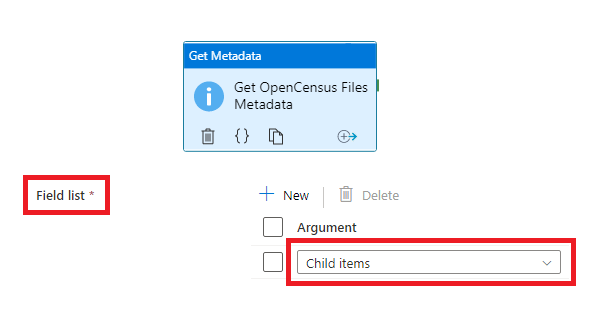
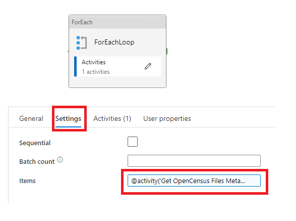
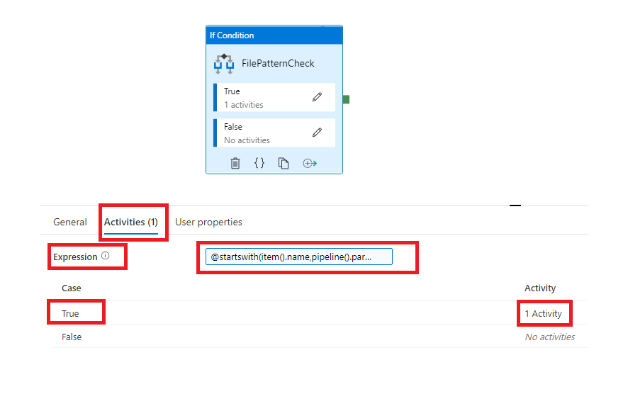
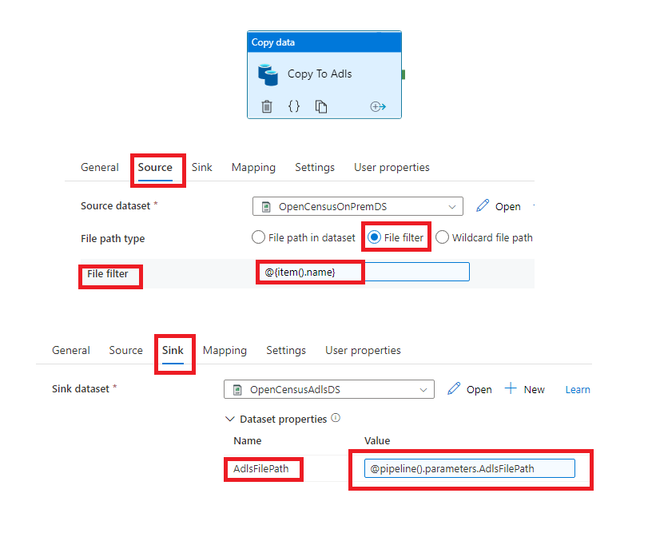
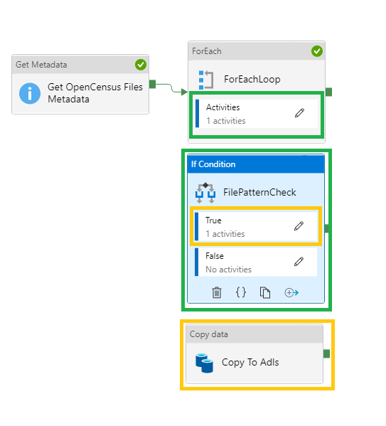
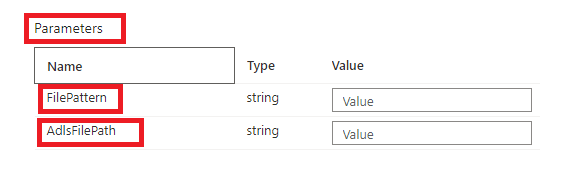
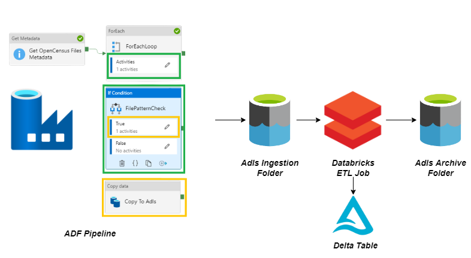

# Problem Statement:

1.  Transfer CSV files from an on-premises machine, starting with a specified prefix, to a chosen Azure Data Lake Storage (ADLS) path using Azure Data Factory (ADF).

2.  Process the files from the ADLS input folder (populated by ADF) and archive them to a specified ADLS archive folder.
    

 # Design and Implementation:

To ensure that files with a specified prefix are ingested into ADLS, the following steps are implemented in Azure Data Factory:

- Create Linked Service to connect to the on-premises virtual machine using a Self-Hosted Integration Runtime.
- Create Linked Service for connecting to ADLS.
- Create Dataset for the CSV files located in the file system of the on-premises virtual machine.
- Create Dataset for the destination CSV files in ADLS, parameterized with AdlsFilePath to allow dynamic folder path selection by the user at runtime.
- Create a pipeline that performs the following actions:
- A Metadata Activity retrieves all child items in the folder specified by the on-premises Dataset (created in step 3).

  

-   The retrieved child items (files) are passed into a ForEach loop, which iterates over each file retrieved by the Metadata Activity.
    

  

The items for the ForEach loop are provided using this expression:

`@activity('Get OpenCensus Files Metadata').output.childItems`

  

- Inside the ForEach loop, an If Condition activity checks whether the file being iterated starts with the provided prefix.
The expression used in the If Condition is:    

The expression used in the If Condition is:
`@startswith(item().name,pipeline().parameters.FilePattern)`

The expression in the *Activities* tab of the *If Condition* is responsible for filtering only those files with the specified prefix. The following expression is used:

where `pipeline().parameters.FilePattern` is a pipeline parameter named *FilePattern* which contains the prefix which has to be provided by the user at the run of the pipeline

-   If the expression provided in the above *If Condition* Activity is True then a *Copy Activity* gets carried out which copies the file having the specified prefix from on-premise virtual machine to specified Adls path
    
 

  

In source of the *Copy Activity* the file name that should be copied is given by the following expression:

  
`@item.name()`

  
which is the filename of coming through the iterator of *ForEach* Activity which met the prefix condition in the *If Condition* Activity

  
In the Copy Activity's sink configuration, the destination path in ADLS is defined by the following expression:

`@pipeline().parameters.AdlsFilePath`

Here, pipeline().parameters.AdlsFilePath is a parameter that refers to the ADLS folder where the matched on-premises files should be ingested. The user provides this path when running the pipeline.

  
Overall Architecture of the Pipeline:

The pipeline requires the user to provide two parameters when triggered: FilePattern (the file prefix) and AdlsFilePath (the ADLS destination path for files with the required prefix).

  

  
***Note*** : On trigger the above pipelines the user is asked to provide the two parameters : FilePattern( file prefix) and AdlsFilePath(the path on adls where the on premise files having the required prefix should be ingested) as shown below :

  

Once the files are transferred, a Databricks script is used to:

Read the files from the ADLS folder populated by the ADF pipeline.
Transform the data by selecting a subset of columns and adding an "insert timestamp" to the records, then write the transformed data to a Delta table.
Archive the processed files to a specified ADLS archive folder.

    

The overall architecture diagram below explains the entire process:

  

  

